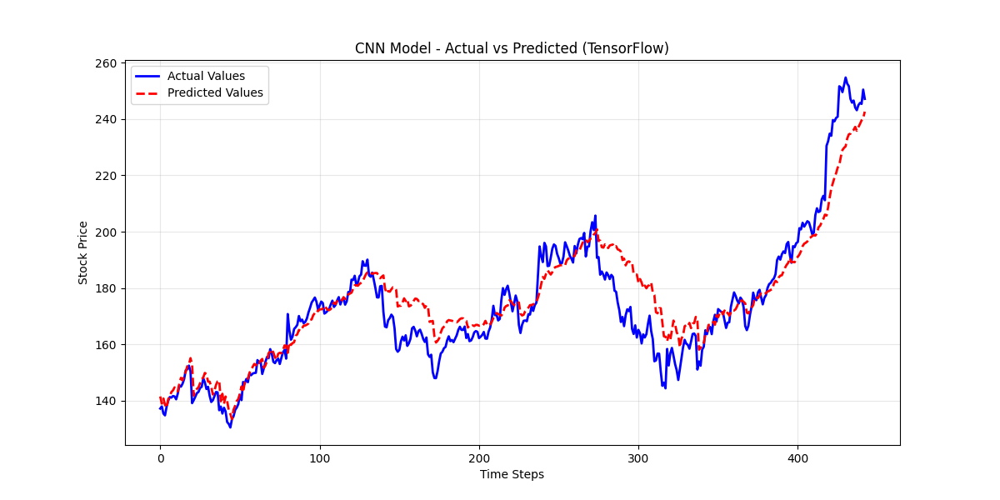
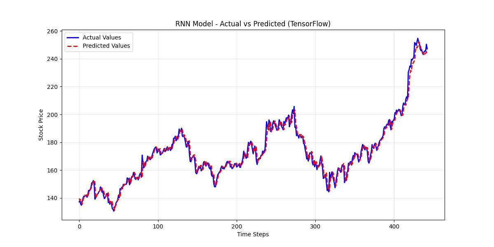
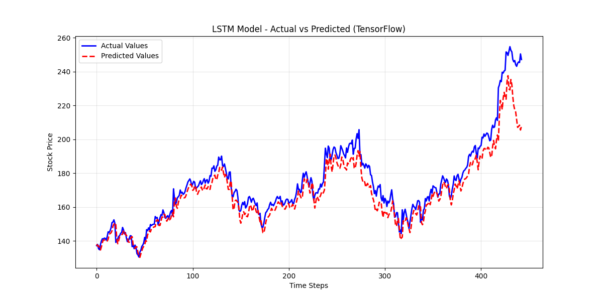
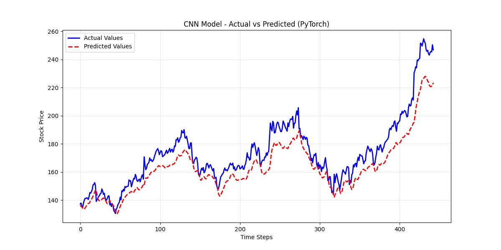
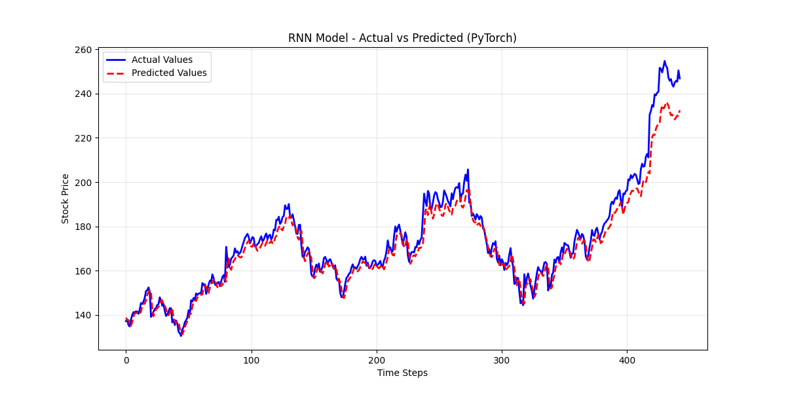
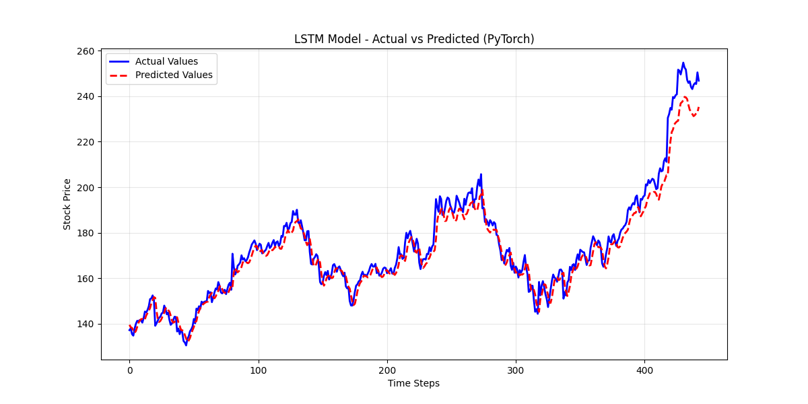

# **Stock Price Prediction with Deep Learning**

This project implements and compares various deep learning models for predicting the stock price of **Google** (`GOOGL`). The models are built using two popular frameworks: **TensorFlow** and **PyTorch**.


## **📝 Project Overview**

The primary goal is to forecast future stock prices based on historical data. Four different neural network architectures are used:

- **Convolutional Neural Networks (CNN)**

- **Recurrent Neural Networks (RNN)**

- **Long Short-Term Memory (LSTM)**

- **Gated Recurrent Unit (GRU)**

The project is structured to train and evaluate each model in both TensorFlow and PyTorch, allowing for a direct comparison of their performance on the same dataset.


## **📂 Project Structure**

The codebase is organized into separate directories for each framework, with shared utility and configuration files.

```
Assignment-2
├── Logs/                  # Log files for model training and evaluation
├── Plots/                 # Evaluation/Prediction plots 
├── PyTorch/               # PyTorch implementation
│   ├── data_loader.py
│   ├── evaluate.py
│   ├── main.py
│   ├── models.py
│   └── train.py
├── TensorFlow/            # TensorFlow implementation
│   ├── data_loader.py
│   ├── evaluate.py
│   ├── main.py
│   ├── models.py
│   └── train.py
├── Trained-Models/        # Trained models
├── constants.py           # Global constants (ticker, dates, etc.)
└── utils.py               # Utility functions (e.g., logger, plotting)
```


## **⚙️ Setup and Installation**

This project uses [uv](https://github.com/astral-sh/uv), an extremely fast Python package installer and resolver, to manage its environment and dependencies.

### 1. Clone the repository:
```bash
git clone https://github.com/sahilbhatt-d3vtech/Assignment-2
cd Assignment-2
```

### 2. Create a virtual environment using `uv`:
```bash
uv venv
```

### 3. Activate the virtual environment:
```bash
source .venv/bin/activate  # On Windows, use `.venv\Scripts\activate`
```

### 4. Sync the dependencies with `uv`:
This command reads the `pyproject.toml` file and installs the exact versions of the required packages into your activated environment.

```bash
uv sync
```


## **🚀 How to Run**
You can run the training and evaluation pipeline for each framework by executing its `main.py` script.

- ### To run the PyTorch models:
```bash
python PyTorch/main.py
```

- ### To run the TensorFlow models:
```bash
python TensorFlow/main.py
```

The scripts will automatically train all models, save the trained weights, log the evaluation metrics, and generate prediction plots in the `Plots/` directory.


## **📊 Model Performance Comparison**

Here is a summary of the performance metrics for each model. The best-performing model in each framework is highlighted in **bold**.

|    Framework   | Model |  RMSE  |   MAE  |
|        -       |  -    |    -   |    -   |
| **TensorFlow** |  CNN  | 8.8362 | 6.4117 |
|                |**RNN**|**3.4568**|**2.4086**|
|                | LSTM  | 8.5981 | 6.0574 |
|                | GRU   | 4.6312 | 3.3448 |
| **PyTorch**    |  CNN  | 11.7333| 9.9902 |
|                |  RNN  | 5.8830 | 4.2048 |
|                |**LSTM**|**5.4098**|**3.9959**|
|                |  GRU  | 5.9963 | 4.4419 |


## **📈 Analysis and Conclusion**

Based on the quantitative metrics from the logs and a visual inspection of the prediction graphs, we can determine the best-performing models.

### **Visual Results**

<center> <b>TensorFlow Predictions</b> </center>

<table align="center">
<tr>
<td align="center">CNN Model</td>
<td align="center">RNN Model</td>
</tr>
<tr>
<td></td>
<td></td>
</tr>
<tr>
<td align="center">LSTM Model</td>
<td align="center">GRU Model</td>
</tr>
<tr>
<td></td>
<td></td>
</tr>
</table>

<br>

<center> <b>PyTorch Predictions</b> </center>

<table align="center">
<tr>
<td align="center">CNN Model</td>
<td align="center">RNN Model</td>
</tr>
<tr>
<td></td>
<td></td>
</tr>
<tr>
<td align="center">LSTM Model</td>
<td align="center">GRU Model</td>
</tr>
<tr>
<td></td>
<td></td>
</tr>
</table>

### **Best Performing Model in TensorFlow**

The **RNN model** is the clear winner for the TensorFlow implementation.
    
- **Quantitative Evidence**: It achieved the lowest **Root Mean Squared Error (RMSE)** of **3.4568** and the lowest **Mean Absolute Error (MAE)** of **2.4086**. These metrics are significantly better than those of the other TensorFlow models.

- **Visual Evidence**: The plot for the TensorFlow RNN model shows the predicted values (red dashed line) tracking the actual values (blue line) very closely, capturing both the overall trend and smaller fluctuations with high accuracy.

### **Best Performing Model in PyTorch**

The **LSTM model** performed the best among the PyTorch implementations.

- **Quantitative Evidence**: It has the lowest **RMSE (5.4098)** and **MAE (3.9959)** within the PyTorch group.

- **Visual Evidence**: The corresponding plot shows a strong correlation between the predicted and actual values. While slightly less accurate than the TensorFlow RNN, it still provides a very good fit to the data compared to the other PyTorch models.


## **Overall Conclusion**

Across both frameworks, the **TensorFlow RNN** model delivered the best overall performance. Its exceptionally low error metrics and visually precise predictions make it the most effective model for this stock price forecasting task. The CNN models in both frameworks performed the worst, suggesting that their architecture is less suited for capturing the temporal dependencies in this time-series data compared to recurrent architectures.